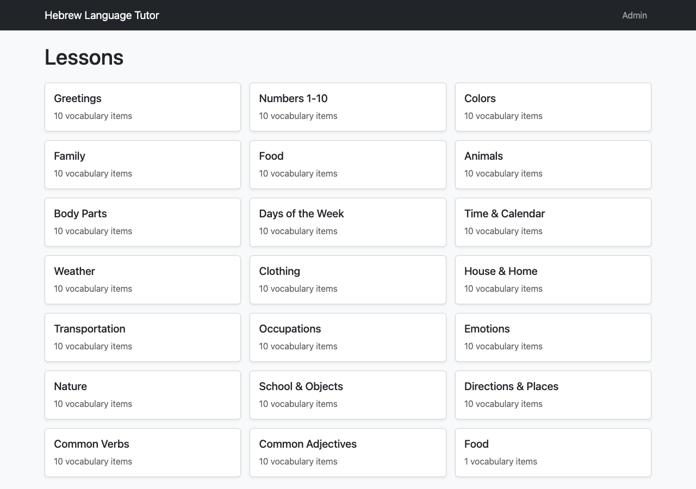
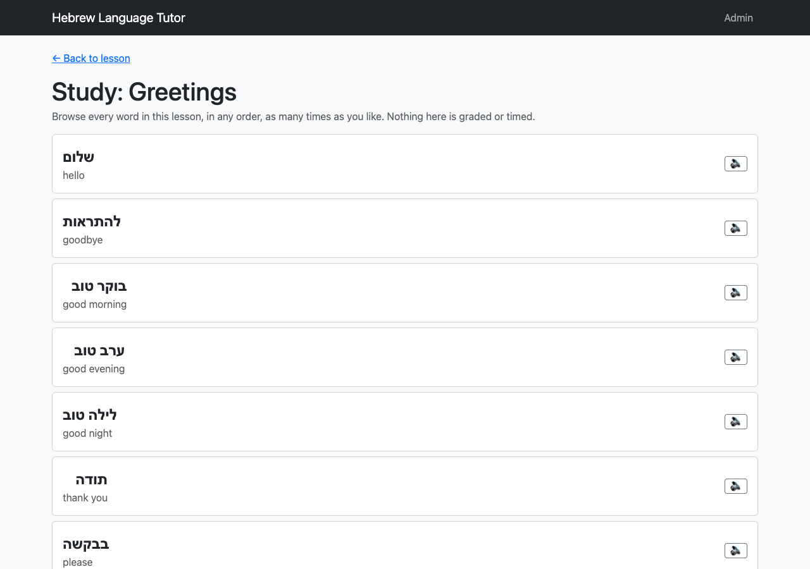

# Hebrew Language Tutor

A simple Hebrew vocabulary learning web app. Browse a catalog of lessons,
review vocabulary in Study mode, practice with low-stakes Quizzes, take a
scored and recorded Exam per lesson, hear any word (and, as of Sprint 01,
its English meaning) pronounced via text-to-speech, review your weakest
words across the whole catalog with a spaced-repetition queue, see your
progress at a glance on a Dashboard, toggle Hebrew vowel points (nikud) on
or off, and add new lessons/vocabulary through an Admin section.

Built as a single FastAPI process serving both a JSON API and a static,
multi-page Bootstrap frontend (no separate frontend server, no build step).

## Features

- **Lesson Catalog** — browse all lessons (starts with 20 lessons, 10
  vocabulary items each) and jump into any of them.
- **Study Mode** — review a lesson's vocabulary (Hebrew word + meaning shown
  together) at your own pace, with no grading.
- **Quiz Mode** — multiple-choice practice with immediate per-question
  feedback and an end-of-quiz score. Retakeable without limit; attempts are
  never saved.
- **Exam Mode** — multiple-choice assessment covering all 10 vocabulary items
  of a lesson. Feedback is withheld until you submit; the score (and a
  review of right/wrong answers) is shown afterward, and the score is saved
  permanently per lesson, viewable again later.
- **Admin** — add new lessons and new vocabulary items directly in the app
  (no code change needed); additions appear immediately in the catalog and
  in Study/Quiz/Exam. Adding is supported; editing/deleting existing content
  is not.
- **Text-to-Speech** — hear any Hebrew vocabulary word, and (as of Sprint 01)
  its English meaning, spoken aloud via the browser's built-in speech
  synthesis. Independent speaker controls for each language, in Study mode
  and on Exam's post-submit review rows; only one utterance plays at a time
  across both languages. No external API, no pre-recorded audio files.
- **Spaced Repetition ("Due for Review") — Sprint 01** — a cross-lesson
  review queue that tracks per-word recall history and resurfaces words
  you're weakest on, independent of any single lesson. Correct recall pushes
  a word further out on a day-ladder (1 → 3 → 7 → 14 → 30 days); an
  incorrect answer (or a word never reviewed) makes it due again
  immediately. Reachable from the "Review" link on every page's navbar.
- **Progress Dashboard — Sprint 01** — a home-adjacent view (reachable from
  the "Dashboard" navbar link) showing per-lesson mastery (from each
  lesson's most recent Exam score), a cross-lesson exam history, and a
  day-streak counter for days on which you completed a Study, Quiz, Exam, or
  Review session.
- **Nikud Toggle — Sprint 01** — a show/hide setting (in every page's navbar)
  for Hebrew vowel points (nikud), so you can practice reading unvocalized
  Hebrew text. Applies app-wide, takes effect immediately, and persists
  across sessions via the browser's `localStorage`. Display-only — it never
  changes stored text and never affects text-to-speech output.

There is no login — the app is single-user, and Admin is an unrestricted
section of the app rather than a separate authenticated role.

## Stack

- **Backend:** Python 3.13, FastAPI, served by Uvicorn.
- **Persistence:** SQLite via the standard-library `sqlite3` module (no ORM).
- **Frontend:** Static HTML/CSS/JS, styled with Bootstrap 5.3.3 loaded from a
  CDN (no npm/Node.js, no build step).

Sprint 01 (see below) added two new SQLite tables (`word_review_state`,
`activity_log`) and four new API endpoints, entirely within this same stack
— no new dependency, package, service, or environment change was needed.

See `docs/architecture.md` for the full technical specification (file
layout, database schema, and API contract, including §11 for Sprint 01).

## Screenshots

| Lesson Catalog | Study Mode |
|---|---|
|  |  |

Sprint 01's new screens (Dashboard, Review/SRS queue) and the extended
Study/Exam TTS controls and nikud toggle do not yet have screenshots
captured here — verification of them was done by API testing and static
frontend review (see "Verification Results" below), not by driving a
browser.

## Setup

Requires Python 3.13 on `PATH` as `python3.13` (override with the
`PYTHON_BIN` env var), and internet access at runtime for the Bootstrap CDN.

```bash
./install.sh
```

This creates a `.venv` virtual environment and installs the dependencies in
`requirements.txt`.

## Running

```bash
./run.sh
```

Starts the app with `uvicorn backend.main:app --reload` on `0.0.0.0:8000`
(override with `HOST`/`PORT` env vars). Open `http://localhost:8000` in a
browser. The SQLite database (`backend/data/app.db`) is created and seeded
with the starting 20 lessons × 10 vocabulary items automatically on first
run if empty.

## Implementation Summary

The app was built through a staged pipeline (concept → features → briefs →
environment → architecture → backend → frontend), documented stage-by-stage
in `summaries/`.

- **Backend** (`backend/`): a single FastAPI app with one thin router per
  feature area (`lessons`, `study`, `quiz`, `exam`, `admin`), a `sqlite3`
  persistence layer with three tables (`lessons`, `vocabulary`,
  `exam_attempts`), and a shared question-generation module
  (`quiz_logic.py`) used by both Quiz and Exam. Quiz questions ask for a
  vocabulary item's meaning given its Hebrew word, with distractors drawn
  from the same lesson (falling back to other lessons if a lesson has fewer
  than 4 items). Quiz is stateless server-side (a `check` endpoint gives
  per-question feedback; the frontend tallies the final score). Exam scores
  are persisted to `exam_attempts`; the per-question review is computed and
  returned once at submission time, not stored.
- **Frontend** (`frontend/`): six static Bootstrap pages (catalog, lesson,
  study, quiz, exam, admin), each with its own JS module, plus `api.js` as
  the sole owner of endpoint URLs/payload shapes and `tts.js` as the sole
  wrapper around the browser's `SpeechSynthesis` API. Admin-authored
  free-text content is HTML-escaped before being rendered elsewhere in the
  app.
- **Seed content**: the 20 starting lessons and 200 vocabulary items
  (`backend/seed_data.py`) are original, backend-authored Hebrew/English
  pairs across 20 themes (Greetings, Numbers, Colors, Family, Food, Animals,
  etc.), not linguistically reviewed — see "Known Issues" below.

### Sprint 01 Enhancement — Study Aids & Progress Tracking

Sprint 01 extended the v0.1 build above through the same nine-stage-style
enhancement pipeline (intake → feature decomposition → feature briefs →
environment reassessment → architecture → backend → frontend →
verification → this documentation pass), adding four features without
changing any existing (v0.1) behavior:

- **Backend** (`backend/`): two new tables, `word_review_state` (per-word
  SRS scheduling state) and `activity_log` (completion timestamps used for
  the day-streak); `lessons`, `vocabulary`, and `exam_attempts` are
  unchanged, no columns added, no rows migrated. Four new endpoints:
  `GET /api/srs/due`, `POST /api/srs/{vocabulary_id}/answer`,
  `POST /api/activity`, and `GET /api/dashboard`, added via three new
  routers (`srs.py`, `activity.py`, `dashboard.py`) and a new
  `srs_logic.py` implementing the day-ladder scheduling rule
  (`[0, 1, 3, 7, 14, 30]` days; a correct answer advances a step, an
  incorrect answer resets to due-now — engineered so a correct answer can
  never itself make a word immediately due again). `quiz_logic.py`'s
  distractor-selection helper was de-privatized so SRS questions are built
  with the same distractor strategy as Quiz/Exam. English Text-to-Speech
  and the Nikud toggle add **no** backend surface — both are entirely
  client-side.
- **Frontend** (`frontend/`): two new pages, `dashboard.html` and
  `srs.html` (each with its own JS module), reachable from new "Dashboard"
  and "Review" links added to every existing page's navbar; `index.html`
  (Lesson Catalog) is unchanged as the app's default `/` route. `tts.js`
  was generalized from a Hebrew-only `speak(text)` to a `speak(text, lang)`
  pair so it can speak either language, with `study.js` and `exam.js`
  (post-submit review rows) gaining a second, independent English speaker
  control alongside the existing Hebrew one. A new `nikud.js` module owns
  an app-wide, `localStorage`-backed show/hide toggle for Hebrew vowel
  points, mounted into every page's navbar, applied via a `data-hebrew`
  convention everywhere Hebrew text is rendered (Admin's "Add Vocabulary"
  input is explicitly excluded, per the brief).
- Full technical detail: `docs/architecture.md` §11. Feature intent:
  `features/briefs/01-english-text-to-speech.md`,
  `02-spaced-repetition.md`, `03-progress-dashboard.md`,
  `04-nikud-toggle.md`. Stage-by-stage record:
  `instructions/enhancements/summaries/01`–`08-*.md`.

## Project Status

All 9 stages of the original build pipeline are complete and committed:
concept, feature decomposition, feature briefs, environment setup,
architecture, backend, frontend, verification, and documentation.

The Sprint 01 enhancement pass (English Text-to-Speech, Spaced Repetition,
Progress Dashboard, Nikud Toggle) has also completed its full 9-stage
enhancement pipeline — intake through this documentation stage — and is
committed. All four features are implemented, verified (50/50 checks
passed, see below), and documented. No existing v0.1 behavior was changed,
removed, or regressed by the pass (confirmed by both Stage 7's
implementation notes and Stage 8's regression spot-check).

## Verification Results

**v0.1 build (`docs/verification-report.md`, §1–7):** a 32-item checklist
derived from `concept.md`, `features/briefs/*.md`, and
`docs/architecture.md`, covering Lesson Catalog, Study, Quiz, Exam, Admin,
Text-to-Speech, and cross-cutting concerns (single-process static serving,
HTML/JS element-ID consistency, XSS-safe rendering of user/admin-entered
text).

**32/32 checks passed. No failures.**

- Backend behavior was verified live via `curl` against the app started with
  `install.sh` + `run.sh`, exercising every documented endpoint including
  edge cases: 404s on unknown lesson/vocabulary ids, 422s on incomplete exam
  submission and invalid admin payloads, 405s confirming no edit/delete
  surface exists, and the low-vocabulary-count distractor fallback for a
  freshly Admin-created lesson.
- Frontend behavior was verified by **static review** of every HTML page and
  its paired JS module against the briefs (including a cross-check that
  every `document.getElementById` lookup resolves to an actual element ID),
  not by browser automation — see "Known Issues" below.

**Sprint 01 enhancement (`docs/verification-report.md`, addendum §8–13):** a
50-item checklist derived from `docs/architecture.md` §11 and
`features/briefs/01–04-*.md`, covering English Text-to-Speech (8 checks),
Spaced Repetition (11), Progress Dashboard (11), Nikud Toggle (9), a
representative v0.1 regression spot-check (7), and enhancement-specific
cross-cutting concerns (4).

**50/50 checks passed. No failures.**

- Backend behavior was verified live via `curl` (plus a small Python/urllib
  helper for multi-request sequences) against a freshly reseeded database,
  including the SRS day-ladder worked example, the dashboard's `null`
  "not yet attempted" mastery state, and `POST /api/activity`'s
  `study`/`quiz`-only validation.
- Multi-day streak walk-back and gap-breaking (a day with no activity
  breaking the streak; falling back to the most recent qualifying day) were
  verified via **direct `sqlite3` manipulation** of `activity_log` rather
  than live multi-day use, since real time could not be advanced within the
  verification session — labeled "direct SQLite verification" in the report
  and kept distinct from the curl-based evidence.
- The nikud strip round-trip was verified against one nikud-bearing
  vocabulary item (`שָׁלוֹם`) added live through the Admin API, since the
  shipped seed data contains zero nikud characters out of the box.
- Frontend behavior was verified by **static review** (plus `node --check`
  on every JS file), consistent with the v0.1 methodology — not by browser
  automation.
- Regression coverage over existing v0.1 behavior was a representative
  spot-check (not a verbatim re-run of the prior 32-check matrix), on the
  basis that Sprint 01 only adds new tables/routers and modifies no
  existing table, router, or endpoint contract.

## Known Issues

- **Frontend was not exercised in an actual browser**, in either the v0.1
  build or the Sprint 01 pass. Stage 7 (frontend engineering, both passes)
  did run headless-Chrome interaction tests while building the frontend,
  but each pass's independent verification stage covered the frontend by
  static code review only (reading HTML/JS against the briefs), not by
  clicking through the app or hearing TTS audio itself. No rendered-layout
  or live-interaction claim is made beyond that static review.
- **Seed vocabulary is unreviewed.** The 200 starting Hebrew/English word
  pairs are original content authored by the backend engineering stage as a
  plausible starting dataset, not verified for linguistic accuracy. Treat as
  a placeholder if translation correctness matters.
- **Seed vocabulary contains no nikud characters**, so the Sprint 01 nikud
  toggle is a visual no-op against out-of-the-box content — hiding/showing
  nikud produces no visible change until a learner or Admin enters
  nikud-bearing Hebrew text. This is expected (confirmed during Stages 5–8),
  not a defect; the strip logic itself was verified correct against a
  manually-added nikud-bearing word.
- **The SRS "Due for Review" queue is single-fetch/single-pass per
  session** (confirmed intended design, per Stage 7). A word answered
  incorrectly becomes due again immediately server-side, but will not
  reappear in the current session's queue — only the next time the learner
  opens the Review page.
- **Multi-day streak behavior was verified via direct database
  manipulation**, not by exercising the API over real elapsed days (not
  possible within a single verification session) — see "Verification
  Results" above.
- **Dashboard and Review page layout, wording, and CSS** are the Frontend
  Engineer's own presentational choices; no wireframe existed in the briefs
  or architecture for either page. They were verified functionally against
  each brief's acceptance expectations, not against any specific visual
  design.
- **No favicon.** Requesting `/favicon.ico` returns an unstyled 404 in the
  browser console; cosmetic only, not part of any brief or the architecture.
- **No pass/fail threshold on Exam mode** — by design, per
  `features/archive/v1/briefs/04-exam-mode.md`: only the score is shown and
  saved, not judged against a threshold.
- **Working-tree state predating the original pipeline run**: at the start
  of the v0.1 build's Stage 4, `LICENSE`, the prior `README.md`, and
  `concept-examples/*` were already deleted in the working tree (unstaged),
  and were left untouched by every subsequent stage (both the original
  build and the Sprint 01 enhancement pass) as out of scope. `LICENSE` and
  `concept-examples/*` remain absent as of this documentation pass. That
  state is unrelated to the app itself but is flagged here in case it needs
  separate attention.

## Next Actions

- Exercise the frontend with real browser/interaction testing (clicking
  through Study/Quiz/Exam/Admin/Dashboard/Review, confirming rendered
  layout, hearing Hebrew and English TTS audio, and exercising the nikud
  toggle visually) to close the gap left by both verification passes'
  static-only frontend review.
- Have a human review the seed vocabulary (`backend/seed_data.py`) for
  translation accuracy if the app will be used for real learning rather than
  as a demo; consider adding nikud-bearing seed content so the Sprint 01
  nikud toggle is visible out of the box rather than only via Admin-added
  words.
- Validate multi-day streak and gap-breaking behavior against real elapsed
  time (not simulated database state) once the app has been used across
  multiple actual days.
- Resolve the pre-existing working-tree deletions noted above
  (`LICENSE`, prior `README.md`, `concept-examples/*`) — decide whether they
  should be restored, committed as intentional removals, or are unrelated
  cleanup from before this pipeline run.
- Consider whether Admin should eventually support editing/deleting content,
  whether pass/fail thresholds or Quiz-attempt history are wanted, and
  whether the SRS queue should refetch mid-session rather than only on
  reopen — all were explicitly scoped out or deferred by the respective
  feature briefs and would need a new pass through the enhancement pipeline
  (starting at feature/enhancement intake) rather than an ad hoc change.
- Run Stage 10 (Archive) to relocate this completed Sprint 01 pass's
  artifacts once the coordinator is ready to start a new sprint.
